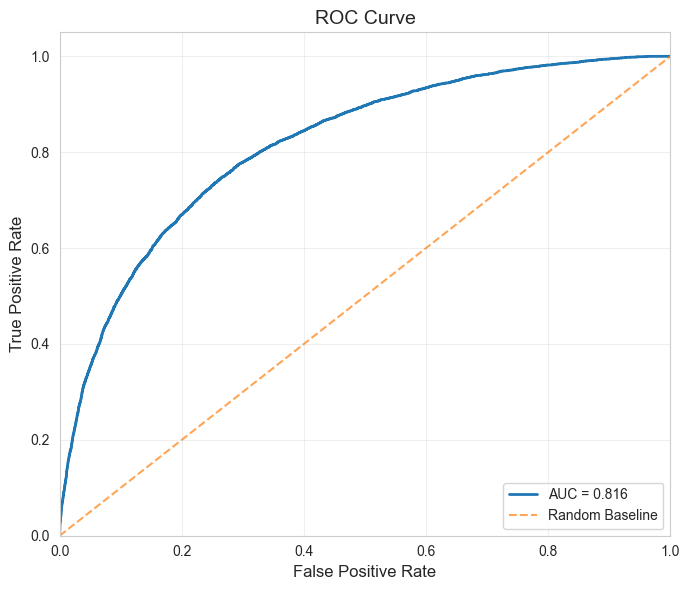

# Project Submission

## Tools Used
This project leverages a modern MLOps stack to ensure reproducibility, scalability, and ease of use:

*   **[Prefect](https://www.prefect.io/)**: For workflow orchestration and observability. It manages the training and inference pipelines as flows and tasks.
*   **[Hydra](https://hydra.cc/)**: For flexible configuration management. It allows easy switching between models (PD vs. LGD) and pipelines via YAML files and CLI overrides.
*   **[MLflow](https://mlflow.org/)**: For experiment tracking. It logs model parameters, metrics, and artifacts to a local SQLite database.
*   **[FastAPI](https://fastapi.tiangolo.com/)**: For serving the trained PD model as a REST API.
*   **[uv](https://github.com/astral-sh/uv)**: For extremely fast Python package management and dependency resolution.
*   **XGBoost & CatBoost**: The core machine learning algorithms used for the Probability of Default (PD) and Loss Given Default (LGD) models respectively.

## Setup

This project uses `uv` for dependency management.

1.  **Install uv** (if not already installed):
    ```bash
    curl -LsSf https://astral.sh/uv/install.sh | sh
    ```

2.  **Sync Dependencies**:
    Run the following command to create the virtual environment and install all locked dependencies:
    ```bash
    uv sync
    ```

3.  **Start Prefect Server**:
    To view the pipeline runs in the Prefect UI, start the server:
    ```bash
    uv run prefect server start
    ```
    Then open [http://localhost:4200](http://localhost:4200) in your browser.

## Running Pipelines

The entry point for all pipelines is `src/main.py`. The specific pipeline to run is controlled by the `project` and `project.pipeline` configuration parameters.

### 1. Train Probability of Default (PD) Model
To run the training pipeline for the PD model (XGBoost):
```bash
uv run src/main.py project=pd_model project.pipeline=training
```
**What this does:**
*   Loads and cleans raw data.
*   Creates the target variable (Default within 12 months).
*   Performs feature engineering (imputation, encoding, transformations).
*   Trains an XGBoost model.
*   Logs metrics to MLflow and saves the model to `models/xgboost_model.joblib`.

### 2. Train Loss Given Default (LGD) Model
To run the training pipeline for the LGD model (CatBoost):
```bash
uv run src/main.py project=lgd_model project.pipeline=training
```
**What this does:**
*   Loads data and filters for defaulted loans.
*   Calculates LGD target.
*   Trains a CatBoost regression model.
*   Saves the model to `models/catboost_regression_model.joblib`.

### 3. Build & Test Inference Pipeline
To build the inference pipeline (combining preprocessing and model) and test it:
```bash
uv run src/main.py project=pd_model project.pipeline=inference
```
**What this does:**
*   **Inference Pipeline Creation**: It loads the individually trained artifacts (OneHotEncoder, OrdinalEncoder, KNNImputer, XGBoost Model) and assembles them into a unified `scikit-learn` pipeline. This ensures that raw data goes in and a prediction comes out, with no manual preprocessing steps required during serving.
*   **Serialization**: Saves the full pipeline to `models/inference_pipeline.joblib`.
*   **Verification**: Runs a quick prediction test on a sample row to ensure the pipeline works end-to-end.

## Configuration

Configuration is managed via **Hydra** in `config/main.yaml`. You can inspect this file to see default paths and settings.

You can override any configuration value from the command line. For example, to use a different raw data file:
```bash
uv run src/main.py project=pd_model data.raw_data=./data/new_loan_data.csv
```

## (Optional) Running the API

To serve the trained PD model via a REST API:

```bash
uv run uvicorn src.app:app --reload
```

*   **API Documentation (Swagger UI)**: Open [http://localhost:8000/docs](http://localhost:8000/docs) in your browser to test the endpoints interactively.
*   **Health Check**: [http://localhost:8000/](http://localhost:8000/)

### Postman Collection
You can import the provided Postman collection to test the API endpoints.
1.  Open Postman.
2.  Click **Import**.
3.  Select the file `tests/Credit Risk ML FAST API.postman_collection.json`.
4.  The collection **Credit Risk ML API Copy** will be imported with the following requests:
    *   **Health Check**: Verifies the API is running.
    *   **Single Prediction - Low Risk**: A sample request representing a low-risk applicant.
    *   **Single Prediction - High Risk**: A sample request representing a high-risk applicant.

## Inspecting Results

### (Optional) MLflow Experiments
To view training runs, metrics, and parameters:
```bash
uv run mlflow ui --backend-store-uri sqlite:///mlflow.db
```
Then open [http://localhost:5000](http://localhost:5000) in your browser.

### Presentation & Reports
The `presentation/` folder contains detailed analysis and interpretability reports.

#### Interpretability (`presentation/interpretability_pd.ipynb`)
We use advanced techniques to explain the model's predictions:
*   **Feature Importance**: Global importance of features in the XGBoost model.
*   **SHAP Values**: Local interpretability to understand *why* a specific loan was classified as high or low risk. This helps in explaining decisions to stakeholders and customers.

## Model Results

### Probability of Default (PD) Model
The PD model achieves strong performance in distinguishing between default and non-default loans.

**ROC-AUC Curve:**


### Loss Given Default (LGD) Model
The LGD model predicts the loss percentage for defaulted loans.

| Model | MAE | RMSE | R² | Spearman Corr | Pearson Corr |
| :--- | :--- | :--- | :--- | :--- | :--- |
| CatBoost LGD | 0.082 | 0.1279 | 0.836 | 0.8994 | 0.9146 |

### Hyperparameter Optimization
We use **Optuna** for hyperparameter tuning. The optimization history, parameter importance, and other visualizations are saved in the `models/optuna_plots/` directory for both models:
*   `models/optuna_plots/pd_model/`: Plots for the Probability of Default model.
*   `models/optuna_plots/lgd_model/`: Plots for the Loss Given Default model.

These plots provide insights into the tuning process and the impact of different hyperparameters on model performance.

### Artifacts
Trained models and encoders are saved in the `models/` directory:
*   `xgboost_model.joblib`
*   `inference_pipeline.joblib`
*   `catboost_regression_model.joblib`
*   `one_hot_encoder.joblib`, `ordinal_encoder.joblib`, `knn_imputer.joblib`

## Future Improvements

1.  **Feature Expansion**: Include more variables (e.g., Occupation) and develop more complex engineered features to capture non-linear relationships and improve model predictive power.
2.  **Containerization**: Dockerize the FastAPI application to ensure consistent environments across development, testing, and production, facilitating easier deployment and reproducibility.
3.  **Advanced MLflow Usage**: Utilize MLflow not just for tracking experiments, but also for end-to-end model lifecycle management, including model registry, versioning, and automated best model selection based on specific metrics.
4.  **Pre-commit Hooks**: Enable pre-commit hooks to automatically enforce code quality standards (linting, formatting) and run tests before every commit, ensuring a clean and stable codebase.
5.  **CI/CD Pipeline**: Implement a Continuous Integration/Continuous Deployment pipeline using GitHub Actions to automate testing, building, and deploying the application and models.
6.  **LLM Interpretability Layer**: Integrate a Large Language Model (LLM) layer to analyze SHAP values and feature importance, providing natural language explanations for model predictions to make them more accessible to non-technical stakeholders.
7.  **Monotonic Constraints**: Apply monotonic constraints to the XGBoost/CatBoost models where appropriate (e.g., higher income should generally lower default risk) to ensure the models behave logically and are robust to outliers.
